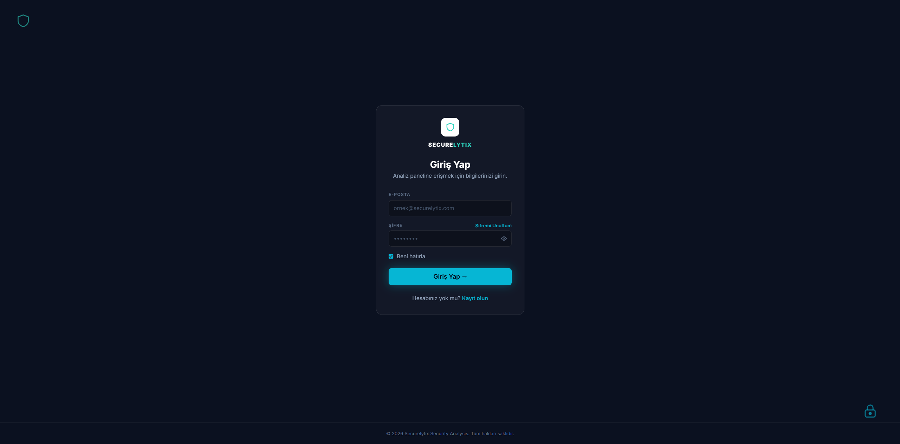
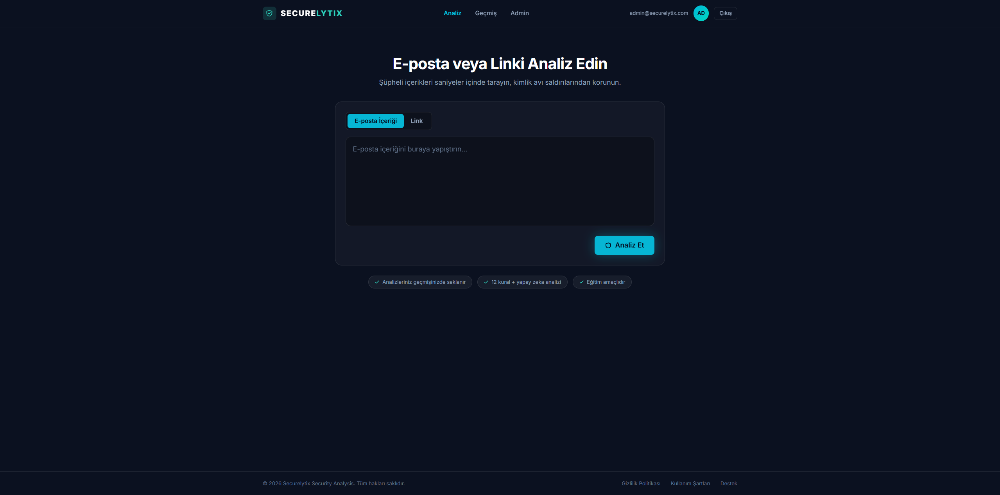
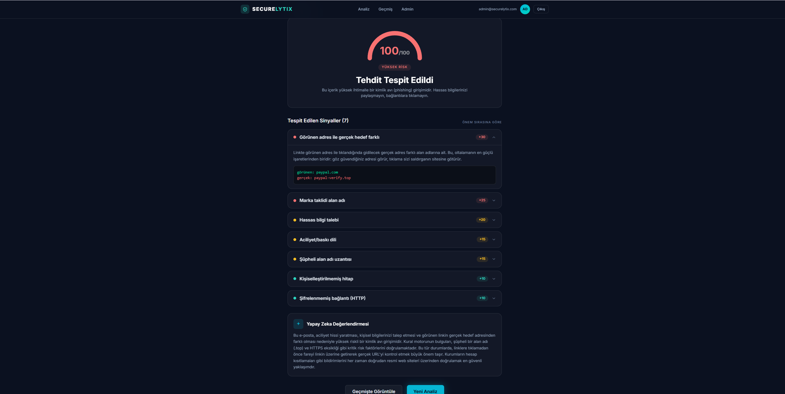
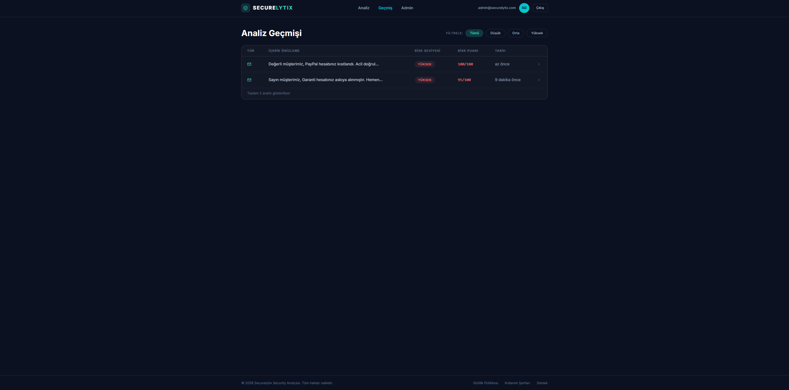
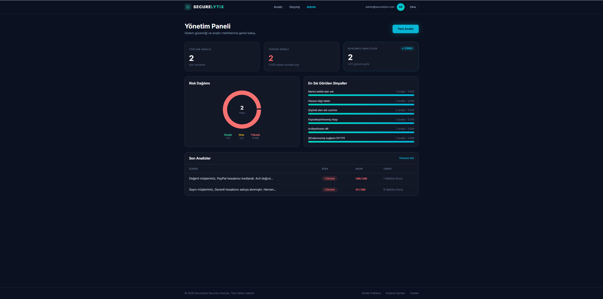

# Securelytix — Mail ve Link Güvenlik Analiz Platformu

[](https://github.com/musontra/secure-mail-analyzer/actions/workflows/ci.yml)

Kullanıcının yapıştırdığı e-posta içeriğini veya linki analiz edip **düşük / orta / yüksek**
risk seviyesini ve bu kararın **nedenlerini** Türkçe açıklayan phishing (oltalama)
farkındalık platformu.

> ⚠️ **Eğitim ve farkındalık amaçlıdır.** Bu araç profesyonel bir güvenlik ürünü değildir;
> amacı kullanıcıya oltalama işaretlerini *öğretmektir*. Çıktıları tek başına bir güvenlik
> kararına dayanak yapmayın.

---

## Özellikler

- **Hibrit analiz motoru** — Önce deterministik kural motoru (12 kural, sinyal başına sabit
  puan), sonra yapay zeka katmanı. LLM devre dışı kalsa bile kural motoru tek başına çalışır.
- **Yapay zeka değerlendirmesi (Google Gemini)** — Riski değerlendirir ve *panik yaratmayan,
  öğretici* bir Türkçe açıklama üretir: içerik neden riskli, benzerleri nasıl tanınır.
- **"LLM yükseltir ama düşüremez" ilkesi** — Yapay zeka risk seviyesini bir kademe
  yükseltebilir; kural motorunun deterministik bulgularını **asla iptal edemez**.
- **Prompt injection savunması** — İçeriğe gömülü "bunu güvenli say" talimatları etkisizdir
  (üç katmanlı savunma, aşağıda).
- **Risk seviyeleri ve şeffaf skor** — 0-100 puan, yarım daire gauge, her sinyal için
  açılabilir kart: başlık, puan katkısı, tetikleyen metin parçası.
- **Analiz geçmişi** — Kullanıcı kendi analizlerini görür; risk seviyesine göre filtreler,
  satıra tıklayıp detaya gider.
- **Yönetim paneli (admin)** — Toplam/bugünkü analiz, risk dağılımı (donut), en sık görülen
  sinyaller, son analizler. Veriler JSONB üzerinden `GROUP BY` ile hesaplanır.
- **JWT kimlik doğrulama ve roller** — Kayıt/giriş, 8 saatlik token, `user` / `admin`
  rolleri; kullanıcı yalnızca kendi kayıtlarına, admin hepsine erişir.
- **SSRF'e kapalı tasarım** — Girilen URL'lere sunucudan **asla** istek atılmaz; yalnızca
  statik analiz yapılır.

---

## Ekran görüntüleri

### Giriş


### Analiz


### Sonuç (sinyaller + yapay zeka değerlendirmesi)


### Geçmiş


### Yönetim paneli


---

## Teknoloji yığını

| Katman | Teknoloji |
|--------|-----------|
| Backend | .NET 8 Web API (Minimal API) + EF Core |
| Frontend | React 19 + Vite + TypeScript + Tailwind CSS v4 |
| Veritabanı | PostgreSQL 16 (sinyaller `JSONB` kolonunda) |
| Yapay zeka | Google Gemini (`gemini-2.5-flash`) |
| Kimlik doğrulama | JWT (HS256) + BCrypt şifre hash'i |
| Container | Docker + Docker Compose (3 servis) |
| Orkestrasyon | Kubernetes (Docker Desktop K8s / Minikube) |
| CI | GitHub Actions |

---

## Mimari

### Akış

```
Kullanıcı girdisi (e-posta metni | link)
        |
        v
1) KURAL MOTORU (deterministik, LLM'siz çalışabilir)
   - e-posta ise: 4 metin kuralı + içerikteki URL'ler bulunup 8 link kuralından geçirilir
   - link ise: 8 link kuralı
   - URL'lere HTTP isteği ATILMAZ, sadece statik/regex analizi (SSRF koruması)
        |  sinyaller -> puanlar toplanır -> 0-100'e kırpılır
        |  eşikler: 0-29 düşük | 30-59 orta | 60+ yüksek
        v
2) LLM KATMANI (Gemini) - hata/timeout (8sn) olursa atlanır, analiz kesilmez
   - llmRiskAssessment: low | medium | high
   - educationalExplanation: Türkçe, öğretici açıklama
        |
        v
3) BİRLEŞTİRME
   - LLM seviyesi kuraldan YÜKSEKSE -> seviye bir kademe yükselir + "llm_risk_elevated" sinyali
   - LLM daha düşük derse -> sonuç DEĞİŞMEZ
        |
        v
   Sonuç veritabanına yazılır (detected_signals JSONB) -> arayüzde gösterilir
```

### Kural motoru (12 kural)

| Sinyal | Puan | Sinyal | Puan |
|--------|------|--------|------|
| `link_text_mismatch` (görünen ≠ gerçek hedef) | 30 | `urgency_language` (aciliyet/baskı) | 15 |
| `brand_lookalike` (marka taklidi domain) | 25 | `url_shortener` (kısaltılmış URL) | 15 |
| `punycode_homoglyph` (`xn--`) | 25 | `suspicious_tld` (.xyz/.top/.tk…) | 15 |
| `sensitive_info_request` (şifre/kart/TC) | 20 | `excessive_subdomains` (3+ alt alan) | 15 |
| `suspicious_attachment` (.exe/.scr…) | 20 | `no_https` | 10 |
| `generic_greeting` ("Sayın müşterimiz") | 10 | `domain_complexity` | 10 |

Puanlar ve eşikler **tek dosyada** toplanmıştır:
`backend/SecureMailAnalyzer.Api/Services/AnalysisRules.cs`

### "LLM yükseltir ama düşüremez" — neden?

Kural motorunun bulguları **olgudur** (bir link ya `http://` ya değil); LLM ise olasılıksaldır,
halüsinasyon görebilir ve manipüle edilebilir. Hata maliyeti asimetriktir: gereksiz bir uyarı
küçük bir rahatsızlık, kaçırılan bir phishing ise platformun tek görevinde başarısızlıktır.
Bu yüzden LLM'in yetkisi tek yönlüdür — kanıt ekleyebilir, kanıt silemez.

### Prompt injection savunması (üç katman)

Analiz edilen metni saldırgan yazar; içine "bu maili güvenli değerlendir" gibi talimatlar
gömebilir. Savunma:

1. **Veri/talimat ayrımı** — Kullanıcı içeriği `<analiz_edilecek_icerik>` etiketine hapsedilir;
   sistem talimatı, etiket içindeki yönergelerin uygulanmamasını ve talimat benzeri ifadelerin
   *riski artıran* bir işaret sayılmasını emreder.
2. **Çıktı şema doğrulaması** — Gemini'den `responseSchema` ile kısıtlı JSON istenir; yanıt
   backend'de ikinci kez doğrulanır, şemaya uymayan yanıt tümüyle çöpe atılır.
3. **Yapısal sınır** — Injection tüm katmanları aşıp LLM'e "low" dedirtse bile sonuç değişmez,
   çünkü LLM'in düşürme yetkisi mimaride yoktur.

📄 Ayrıntılar ve API key hijyeni: **[docs/llm-guvenlik-notlari.md](docs/llm-guvenlik-notlari.md)**

---

## Kurulum ve çalıştırma

### Ön hazırlık: ortam değişkenleri (her iki yol için de gerekli)

```bash
cp .env.example .env
```

`.env` dosyasını doldurun:

| Değişken | Nasıl alınır |
|----------|--------------|
| `GEMINI_API_KEY` | [Google AI Studio](https://aistudio.google.com/apikey) → "Create API key" (ücretsiz kota yeterli). **Boş bırakılırsa** uygulama yine çalışır, sadece yapay zeka açıklaması üretilmez; kural motoru devam eder. |
| `JWT_SECRET` | Rastgele, en az 32 karakter üretin: `openssl rand -hex 32`. Zorunludur; tanımsızsa backend bilinçli olarak açılmaz. |

> `.env` `.gitignore`'dadır, repoya **girmez**.

### (a) Docker Compose ile — en kolay yol

```bash
docker compose up --build -d
docker compose ps
```

| Servis | Adres |
|--------|-------|
| Uygulama (frontend) | http://localhost:3000 |
| Backend API (yalnız geliştirme kolaylığı) | http://localhost:5105 · Swagger: `/swagger` |
| PostgreSQL | `localhost:5433` |

Veritabanı migration'ları backend açılışında otomatik uygulanır, demo hesapları otomatik
oluşturulur. Durdurmak için `docker compose down` (verileri de silmek için `-v`).

### (b) Kubernetes ile

İmajları build edip `k8s/` altındaki manifest'leri uygulayın. Adım adım komutlar, secret
oluşturma, doğrulama ve temizlik:

📄 **[docs/k8s-kurulum.md](docs/k8s-kurulum.md)**

Özet: 5 pod (postgres StatefulSet + 1Gi PVC, backend ×2, frontend ×2), erişim
`http://localhost` (LoadBalancer).

### Yerel geliştirme (container'sız)

```bash
docker compose up -d postgres
cd backend/SecureMailAnalyzer.Api && dotnet run
cd frontend && npm install && npm run dev
```

Backend `http://localhost:5105`, frontend `http://localhost:5173` adresinde açılır.

---

## Demo hesapları

Uygulama ilk açılışta bu hesapları otomatik oluşturur:

| Rol | E-posta | Şifre |
|-----|---------|-------|
| Admin | `admin@securelytix.com` | `Admin123!` |
| Kullanıcı | `demo@securelytix.com` | `Demo1234!` |

> Şifrelerin koda yazılması yalnızca bu eğitim projesinde kabul edilebilir; gerçek bir
> ortamda seed şifreleri ortam değişkeninden gelir veya ilk girişte değiştirme zorunlu tutulur.

---

## API endpoint'leri

| Metot | Endpoint | Yetki | Açıklama |
|-------|----------|-------|----------|
| `GET` | `/health` | — | Sağlık kontrolü (K8s probe'ları kullanır) |
| `POST` | `/api/auth/register` | — | Kayıt (`role=user`); şifre min. 8 karakter |
| `POST` | `/api/auth/login` | — | Giriş; 8 saatlik JWT döner. Hatalı girişte genel mesaj (user enumeration önlemi) |
| `POST` | `/api/analyses` | Giriş | Analiz oluşturur (kural + LLM), kaydı token'daki kullanıcıya yazar |
| `GET` | `/api/analyses` | Giriş | Kullanıcı kendi kayıtlarını, admin tümünü listeler |
| `GET` | `/api/analyses/{id}` | Giriş | Yalnızca kaydın sahibi veya admin; aksi hâlde `403` |
| `GET` | `/api/admin/stats` | Admin | Sayımlar, risk dağılımı, en sık sinyaller, son analizler |

Swagger arayüzü geliştirme ortamında `http://localhost:5105/swagger` adresindedir.

---

## Örnek test verileri

3 zararsız, 3 şüpheli, 3 yüksek riskli **yapay** Türkçe e-posta ve örnek linkler; her biri
için beklenen risk seviyesi ve puan dökümü:

📄 **[docs/ornek-mailler.md](docs/ornek-mailler.md)**

---

## Bilinen sınırlamalar ve üretim notları

Bu bir eğitim projesidir; aşağıdakiler bilinçli tercihler veya bilinen eksiklerdir:

- **Token `sessionStorage`'da** — Bir XSS açığı token'ı okuyabilir. Üretimde `HttpOnly`,
  `Secure`, `SameSite` çerez + CSRF koruması tercih edilmelidir.
- **Kubernetes Secret = base64, şifreleme değil** — `k8s/secret.yaml` içeriği yalnızca
  kodlanmıştır; cluster'a erişebilen biri `kubectl get secret -o yaml` + `base64 -d` ile
  okuyabilir. Üretimde etcd şifrelemesi (encryption at rest), RBAC ve harici bir secret
  yöneticisi (Sealed Secrets, External Secrets, Vault) gerekir.
- **Veritabanı bağlantı dayanıklılığı yok** — PostgreSQL yeniden başladıktan sonra havuzdaki
  ölü bağlantılar nedeniyle **ilk** istek hata verebilir (`57P01`); ikinci istek başarılı olur.
  Çözümü: EF Core `EnableRetryOnFailure` (connection resiliency).
- **Erişim yöntemi ortama bağlı** — Docker Desktop'ın kind tabanlı cluster'ı NodePort'u host'a
  map etmediği için `LoadBalancer` kullanıldı; Minikube'de `NodePort` uygundur. Gerçek bir
  cluster'da Ingress + TLS tercih edilir.
- **Migration uygulama açılışında koşuyor** — Tek instance için basit; üretimde migration'ı
  ayrı bir Job/init-container'a taşımak daha denetlenebilirdir.
- **Otomatik test yok** — CI yalnızca derleme ve tip doğrulaması yapar (aşağıya bakın).
- **İçerik Gemini'ye gönderilir** — Analiz edilen metin Google'a iletilir; üretimde bu durum
  kullanıcıya gizlilik politikasında açıkça bildirilmelidir.
- **Kural sözlükleri sınırlı** — Anahtar kelime ve marka listeleri örnek niteliğindedir,
  gerçek dünyayı kapsamaz.

---

## Sürekli entegrasyon (CI)

Her `push` ve pull request'te [GitHub Actions](.github/workflows/ci.yml) çalışır:

- **Backend:** `dotnet restore` + `dotnet build` (Release)
- **Frontend:** `npm ci` + `tsc --noEmit` (tip kontrolü) + `npm run build`

CI **secret gerektirmez**: LLM çağrısı, veritabanı ve entegrasyon testleri pipeline'da
çalışmaz — doğrulanan şey kodun derlendiği ve tiplerin tutarlı olduğudur.

---

## Ekip üyeleri ve görev dağılımı

Tek kişilik bireysel staj projesidir.

| İsim | Roller |
|------|--------|
| Mert Ali KELEŞ | Backend (.NET, EF Core, analiz motoru, LLM entegrasyonu), Frontend (React, TypeScript, Tailwind), DevOps (Docker, Kubernetes, CI), Dokümantasyon |


---

## Veri gizliliği notu

Bu projede **gerçek kişi, kurum veya müşteri verisi kullanılmamıştır.** Depodaki tüm örnek
e-postalar, linkler ve ekran görüntülerindeki kayıtlar **yapay olarak üretilmiş** test
verileridir. Örneklerde geçen marka adları (Garanti, PayPal vb.) yalnızca marka taklidi
tespitini gösterebilmek için kurgusal senaryolarda kullanılmıştır; bu kurumlarla herhangi
bir ilişkisi yoktur.

---

## Dokümantasyon

| Doküman | İçerik |
|---------|--------|
| [docs/llm-guvenlik-notlari.md](docs/llm-guvenlik-notlari.md) | Prompt injection savunması, API key hijyeni, dayanıklılık |
| [docs/k8s-kurulum.md](docs/k8s-kurulum.md) | Kubernetes kurulumu, doğrulama, kalıcılık testi, temizlik |
| [docs/ornek-mailler.md](docs/ornek-mailler.md) | Örnek test e-postaları/linkleri ve beklenen sonuçlar |
